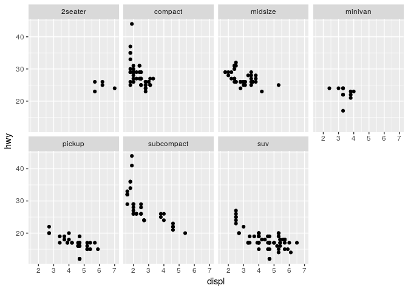
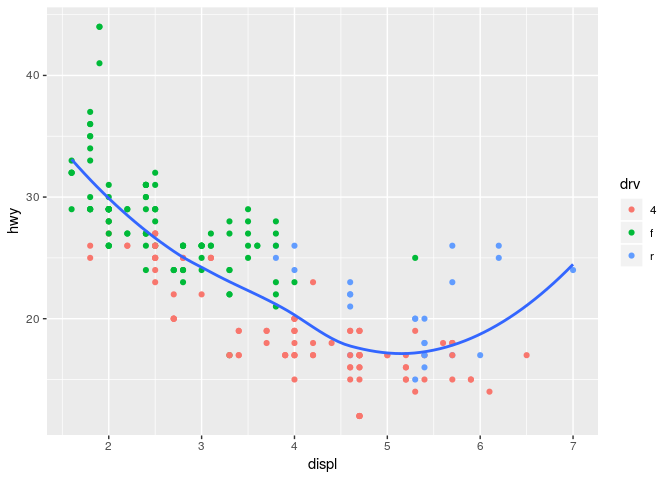
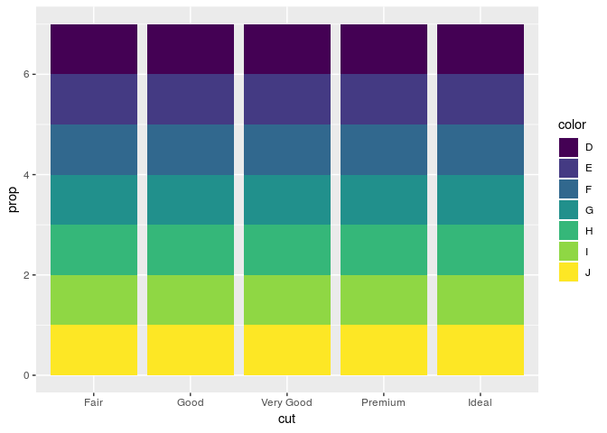

Homework 2: ggplot
================
2019-03-08

``` r
library(tidyverse)
```

    ## ── Attaching packages ───────────────────────────────────────────── tidyverse 1.2.1 ──

    ## ✔ ggplot2 3.1.0       ✔ purrr   0.3.0  
    ## ✔ tibble  2.0.1       ✔ dplyr   0.8.0.1
    ## ✔ tidyr   0.8.2       ✔ stringr 1.4.0  
    ## ✔ readr   1.3.1       ✔ forcats 0.4.0

    ## ── Conflicts ──────────────────────────────────────────────── tidyverse_conflicts() ──
    ## ✖ dplyr::filter() masks stats::filter()
    ## ✖ dplyr::lag()    masks stats::lag()

  - Take the first faceted plot in this section:

<!-- end list -->

``` r
ggplot(data = mpg) + 
  geom_point(mapping = aes(x = displ, y = hwy)) + 
  facet_wrap(~ class, nrow = 2)
```

<!-- -->

What are the advantages to using faceting instead of the colour
aesthetic? What are the disadvantages? How might the balance change if
you had a larger dataset?

Using different colors allows visual inference of the distribution of
the groups under comparison. But there is apparent limit how much of
such information can be accommodated onto one graph before it gets too
cluttered. To reducing visual clutter and overplotting, we can use small
subplots to bring out subsets from our data. If we had bigger dataset
than now here, it will be harder to compare information, because there
will be dozens of smaller graphs.

  - Recreate the R code necessary to generate the following
graphs.

<!-- end list -->

``` r
knitr::include_graphics(paste0("plots/fig", 1:6, ".png"))
```


``` r
ggplot(data = mpg) + 
  geom_point(mapping = aes(x = displ, y = hwy)) +
  geom_smooth(mapping = aes(x = displ, y = hwy), se = FALSE)
```

    ## `geom_smooth()` using method = 'loess' and formula 'y ~ x'

<!-- -->

``` r
ggplot(data = mpg) +
  geom_point(mapping = aes(x = displ, y = hwy)) +
  geom_smooth(mapping = aes(x = displ, y = hwy, group = drv), se = FALSE)
```

    ## `geom_smooth()` using method = 'loess' and formula 'y ~ x'

<!-- -->

``` r
ggplot(data = mpg, mapping = aes(x = displ, y = hwy, color = drv)) + 
  geom_point() + 
  geom_smooth(se = FALSE)
```

    ## `geom_smooth()` using method = 'loess' and formula 'y ~ x'

<!-- -->

``` r
ggplot(data = mpg, mapping = aes(x = displ, y = hwy)) + 
  geom_point(mapping = aes(color = drv)) +
  geom_smooth(se = FALSE)
```

    ## `geom_smooth()` using method = 'loess' and formula 'y ~ x'

<!-- -->

``` r
ggplot(data = mpg, mapping = aes(x = displ, y = hwy)) + 
  geom_point(aes(color = drv)) +
  geom_smooth(aes(linetype = drv), se = FALSE)
```

    ## `geom_smooth()` using method = 'loess' and formula 'y ~ x'

<!-- -->

``` r
ggplot(data = mpg, mapping = aes(x = displ, y = hwy)) + 
  geom_point(size = 4, color = "white") +
  geom_point(aes(color = drv))
```

<!-- -->

``` r
ggplot(data = mpg, mapping = aes(x = displ, y = hwy, fill = drv)) + 
  geom_point(shape = 21, stroke = 1.5, color = "white", size = 2)
```

<!-- -->

  - Most geoms and stats come in pairs that are almost always used in
    concert. Read through the documentation and make a list of all the
    pairs. What do they have in common?

| geom                | stat                |
| ------------------- | ------------------- |
| `geom_bar()`        | `stat_count()`      |
| `geom_bin2d()`      | `stat_bin_2d()`     |
| `geom_boxplot()`    | `stat_boxplot()`    |
| `geom_contour()`    | `stat_contour()`    |
| `geom_count()`      | `stat_sum()`        |
| `geom_density()`    | `stat_density()`    |
| `geom_density_2d()` | `stat_density_2d()` |
| `geom_hex()`        | `stat_hex()`        |
| `geom_freqpoly()`   | `stat_bin()`        |
| `geom_histogram()`  | `stat_bin()`        |
| `geom_qq_line()`    | `stat_qq_line()`    |
| `geom_qq()`         | `stat_qq()`         |
| `geom_quantile()`   | `stat_quantile()`   |
| `geom_smooth()`     | `stat_smooth()`     |
| `geom_violin()`     | `stat_violin()`     |
| `geom_sf()`         | `stat_sf()`         |

Almost all of them have the same “word” after the "\_".

  - Compare and contrast geom\_jitter() with geom\_count().

`geom_jitter` randomly moves the points to stop them overlapping.
`geom_count` count the number of observations at each location, then
maps the count to point area.

  - What does the plot below tell you about the relationship between
    city and highway mpg (fuel consumption)? Why is coord\_fixed()
    important? What does geom\_abline() do?

<!-- end list -->

``` r
ggplot(data = mpg, mapping = aes(x = cty, y = hwy)) +
  geom_point() + 
  geom_abline() +
  coord_fixed()
```

<!-- -->

Given correlation is linear. If cty (city mpg) is higher, then hwy
(highway mpg) is also high, which means that the most economical cars
are placed in the upper part of graph. `geom_abline()` produce the
reference line. The function `coord_fixed()` ensures that the line
produced by `geom_abline()` is at a 45-degree angle. If we remove
`coord_fixed()`, then the line would not be at 45-degree angle anymore.
Points are above line which means that highway drive is more economical
that drive in city. If points were below line, that will tell us that
those cars are more economical in city than in highway.

  - What is the default geom associated with stat\_summary()?

<!-- end list -->

``` r
ggplot(data = diamonds) + 
  stat_summary(
    mapping = aes(x = cut, y = depth),
    fun.ymin = min,
    fun.ymax = max,
    fun.y = median
  )
```

<!-- -->

The default geom for stat\_summary() is `geom_pointrange()`.

How could you rewrite the previous plot to use that geom function
instead of the stat function?

``` r
ggplot(data = diamonds) +
  geom_pointrange(
    mapping = aes(x = cut, y = depth),
    stat = "summary",
    fun.ymin = min,
    fun.ymax = max,
    fun.y = median
  )
```

<!-- -->

  - What does geom\_col() do? How is it different to geom\_bar()?

The `geom_col()` function has different default stat than `geom_bar()`.
The `geom_bar()` function only expects an `x` variable, but the
`geom_col()` function expects that the data contains both `x` values and
`y` values. The geom\_col() should be used instead of geom\_bar(), if we
want the heights of the bars to represent values in the data.

  - What variables does stat\_smooth() compute? What parameters control
    its behaviour?

Computed variables: y - predicted value ymin - lower pointwise
confidence interval around the mean ymax - upper pointwise confidence
interval around the mean se - standard error

Parameters that control its behaviour: method, formula, fullrange,
level, n, na.rm

  - In our proportion bar chart, we need to set group = 1. Why? In other
    words what is the problem with these two graphs?

<!-- end list -->

``` r
ggplot(data = diamonds) + 
  geom_bar(mapping = aes(x = cut, y = ..prop..))
```

<!-- -->

``` r
ggplot(data = diamonds) + 
  geom_bar(mapping = aes(x = cut, fill = color, y = ..prop..))
```

<!-- -->

We need to set “group = 1” to get relative proportions of categories in
our dataset. If `group = 1` is not included, then all the bars in the
plot will have the same height, a height of 1. We do not a propriate
distribution.
